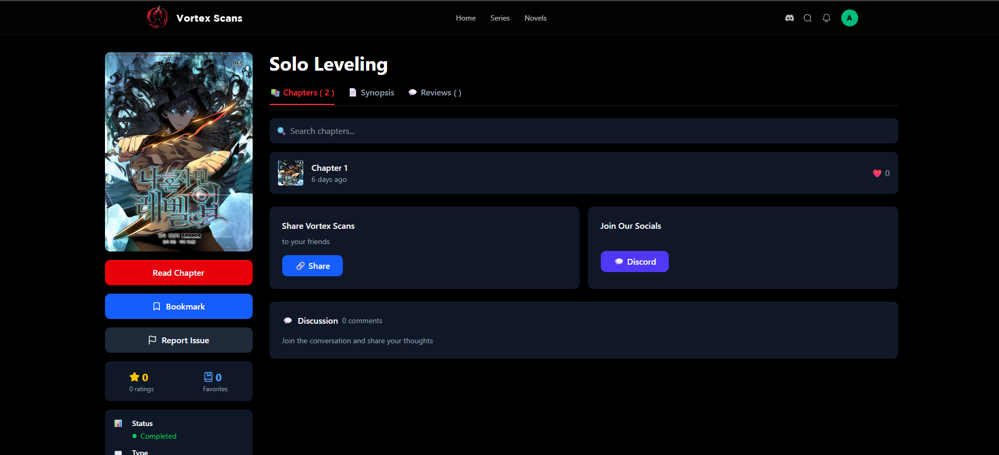

# 📚 ComicStream

**A high-performance, full-stack web application designed for seamless digital comic consumption.** ComicStream bridges the gap between massive media libraries and smooth user experiences. By leveraging a robust Laravel/Node.js backend and a responsive React frontend, it provides a "Netflix-style" experience for comic enthusiasts.

---

## ✨ Key Features

* **Adaptive Reading Modes:** Optimized viewer for both desktop and mobile, supporting vertical scroll and single-page layouts.
* **Intelligent Image Compression:** An automated pipeline that compresses high-resolution assets on-the-fly, reducing bandwidth usage by up to 60% without sacrificing visual quality.
* **Dynamic Library Management:** Easily browse, filter, and search through thousands of titles with instant metadata fetching.
* **Performance First:** Built with lazy-loading and server-side caching to ensure lightning-fast page transitions.

---

## 📸 Interface Preview

### User Dashboard

---

### Comics Library

---

### Immersive Reading Experience

---

## 🛠️ Tech Stack

| Layer | Technology |
| --- | --- |
| **Frontend** | React.js, CSS3 (Flexbox/Grid), JavaScript (ES6+) |
| **Backend** | Laravel (PHP), Node.js (Image Processing Microservice) |
| **Database** | MySQL / PostgreSQL |
| **Optimization** | GD Library / Sharp (for auto-compression) |

## ⚙️ Technical Highlight: Auto-Compression

One of the core challenges of web-based comics is the delivery of high-resolution images. ComicStream implements a custom middleware that:

1. Detects the user's connection speed and device type.
2. Triggers a Node.js worker to resize/compress images via the **Sharp** library.
3. Caches the optimized versions for subsequent requests, ensuring the perfect balance between **fidelity** and **load speed**.

---

## 🤝 Contributing

Contributions make the open-source community an amazing place to learn, inspire, and create.

1. Fork the Project
2. Create your Feature Branch (`git checkout -b feature/AmazingFeature`)
3. Commit your Changes (`git commit -m 'Add some AmazingFeature'`)
4. Push to the Branch (`git push origin feature/AmazingFeature`)
5. Open a Pull Request

## 📄 License

Distributed under the **MIT License**. See `LICENSE` for more information.
